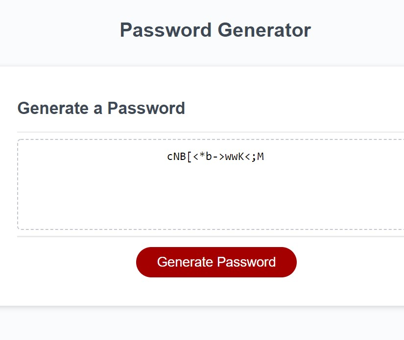

# Password Generator Starter Code

## Description
This is a password generator that assists in making secure passwords for sensitive date. It will randomly generate a password that meets certain criteria in order to create a strong password that provides greater security.

## Webpage
The webpage will present the user with a series of prompts for password criteria including length of password, and will require at least one of the following: lowercase, uppercase, numberic, and/or special characters.

Once all prompts are correctly answered, you will receive a password like in this screenshot.

## Built With
This website uses the following:
* HTML
* CSS
* Javascript

## Criteria
This meets the following acceptance criteria:

GIVEN I need a new, secure password
WHEN I click the button to generate a password
THEN I am presented with a series of prompts for password criteria
WHEN prompted for password criteria
THEN I select which criteria to include in the password
WHEN prompted for the length of the password
THEN I choose a length of at least 8 characters and no more than 128 characters
WHEN asked for character types to include in the password
THEN I confirm whether or not to include lowercase, uppercase, numeric, and/or special characters
WHEN I answer each prompt
THEN my input should be validated and at least one character type should be selected
WHEN all prompts are answered
THEN a password is generated that matches the selected criteria
WHEN the password is generated
THEN the password is either displayed in an alert or written to the page

Visit the live site here: https://meggedde.github.io/Challenge3/
